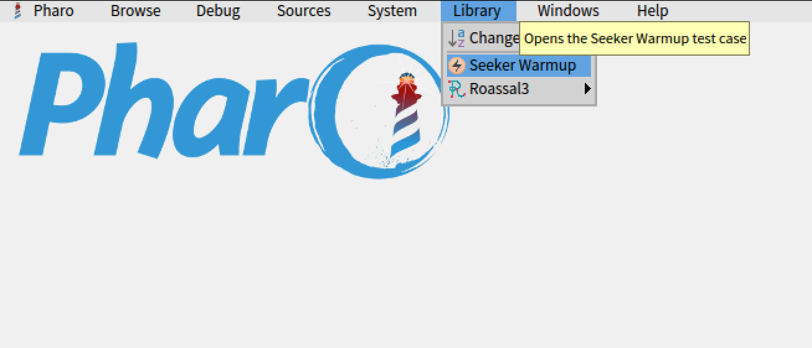
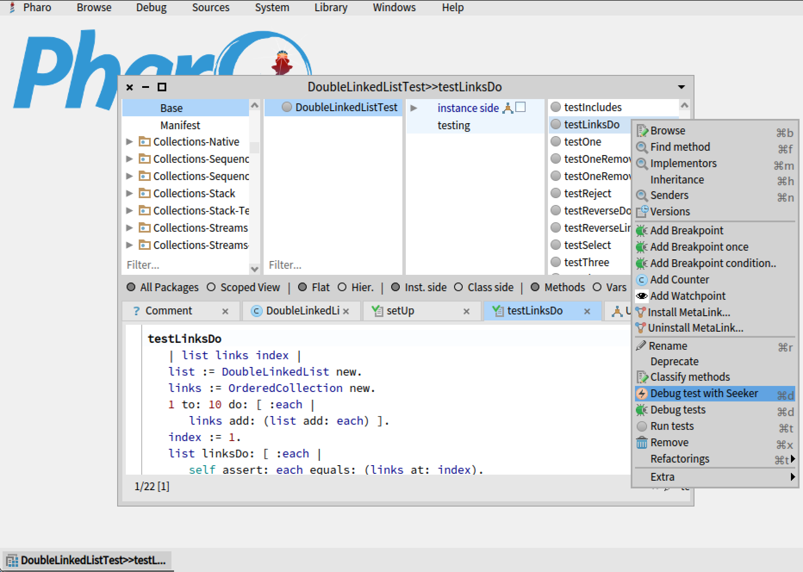
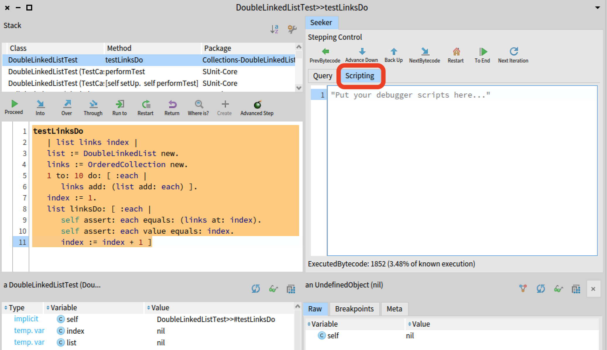
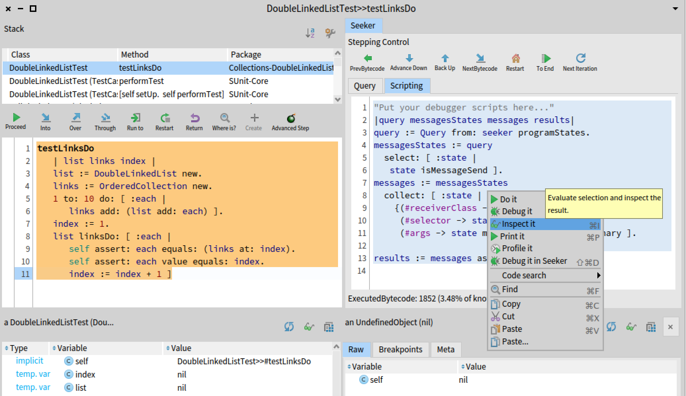

# 2021-TTQs.
Time traveling queries publication repository. 2021.
## Contents
1. Experiment results. 
1. Time-Traveling Queries repository. 
1. How to execute the examples. 

## 1. Experiment results.
Anonymized experiment results are contained in the folder [experiment-results](./experiment-results).  

## 2. Time-Traveling Queries repository.
The repository includes code and examples to execute TTQs programmatically and through the UI.
A Pharo 9.0 64 bits image is required.

Do this:
```Smalltalk
Metacello new
    baseline: 'Seeker';
    repository: 'github://willembrinck/2021-ttqs:main';
    load.
    
#SeekerInstallHelpers asClass install.
```
*Beware that the SeekerInstallHelpers class>>install call will overwrite parts of the StDebugger's code of your image*

The `SeekerInstallHelpers>>#install` will:
- Enable the debugger extension.
- Change the `StDebugger` `debuggerActionModel` default class to `SeekerStDebuggerActionModel`. This will make the StDebugger to need Seeker to be enabled to work. (You can still debug normaly without Seeker, but it will be shown at the right, even if it is not used). Don't use this if you rely on your own modifications of `StDebuggerActionModel`. If you unload Seeker, you will need to manually restore `StDebugger>>#debuggerActionModel`. 

### Limitations

- This version of Seeker supports only test cases. 
  - It doesn't support tests tear down phase.
- Performance: Executing code with Seeker is slow. If it takes more than 10 seconds to coplete an operation, force quit it.

The version of Seeker available in this repository is designed specifically for the experiment, and currently outdated for other purposes.

An updated version of Seeker is available in its official repository: https://github.com/maxwills/SeekerDebugger

## 3. How to execute the examples.

### Performing queries through the UI.
The code provided in the repository includes an executable example.
Once the baseline is installed (as described in previous step), open the Library Menu, and select "Seeker Warmup".  

  

Then, in the code browser, right click a test case and select "Debug test with Seeker" from the context menu.  

  

Finally, follow the steps described in the [Quick Reference document](./resources/TTQs-QuickReference.pdf).

### Programmatically executing queries.
To programmatically execute the query used as example in the paper, open the debugger UI as described in the previous part.  
Then, go to the Scripting tab, as shown here:  

  

And paste the following code.  

```Smalltalk
|query messagesStates messages results|
query := Query from: seeker programStates.
messagesStates := query
  select: [ :state | 
	state isMessageSend ].
messages := messagesStates
  collect: [ :state |
    {(#receiverClass -> state msgReceiverClass).
     (#selector -> state msgSelector).
     (#args -> state msgArguments)} asDictionary ].

results := messages asTTQResult.
```

To perform the query and inspect the results, select all the code, right click and choose "inspect" from the context menu.  

   

Finally, to time travel to a result item, add the following code to the script, and "Do it".

```Smalltalk
seeker timeTravelToTraceTime: (results at: 500) timeIndex asExecutedBytecodeTraceTime
```

